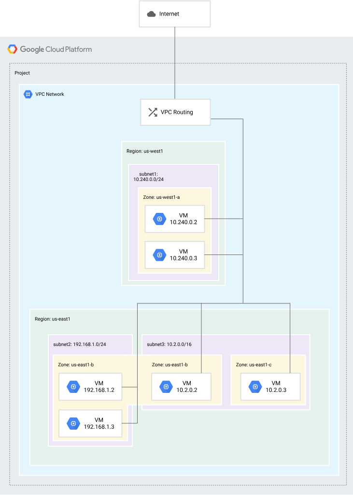

# Networking
* Connect your networks and workloads, load balance traffic, and secure your network.

- Explore networking in Google Cloud 
Read documentation and Cloud Architecture Center articles about networking products, capabilities, and procedures.

## Virtual Private Cloud (VPC) overview
Virtual Private Cloud (VPC) provides networking functionality to Compute Engine virtual machine (VM) instances, Google Kubernetes Engine (GKE) clusters, and serverless workloads.

VPC provides networking for your cloud-based resources and services that is global, scalable, and flexible.

This page provides a high-level overview of VPC concepts and features.

### VPC networks
You can think of a VPC network the same way you'd think of a physical network, except that it is virtualized within Google Cloud. A VPC network is a global resource that consists of a list of regional virtual subnetworks (subnets) in data centers, all connected by a global wide area network. VPC networks are logically isolated from each other in Google Cloud.

 VPC network example (click to enlarge).

A VPC network does the following:

Provides connectivity for your Compute Engine virtual machine (VM) instances, including Google Kubernetes Engine (GKE) clusters, serverless workloads, and other Google Cloud products built on Compute Engine VMs.
Offers built-in internal passthrough Network Load Balancers and proxy systems for internal Application Load Balancers.
Connects to on-premises networks by using Cloud VPN tunnels and VLAN attachments for Cloud Interconnect.
Distributes traffic from Google Cloud external load balancers to backends.
For more information, see VPC networks.

### Firewall rules
Each VPC network implements a distributed virtual firewall that you can configure. Firewall rules let you control which packets are allowed to travel to which destinations. Every VPC network has two implied firewall rules that block all incoming connections and allow all outgoing connections.

The default network has additional firewall rules, including the default-allow-internal rule, which permit communication among instances in the network.
For more information, see VPC firewall rules.

### Routes
Routes tell VM instances and the VPC network how to send traffic from an instance to a destination, either inside the network or outside of Google Cloud. Each VPC network comes with some system-generated routes to route traffic among its subnets and send traffic from eligible instances to the internet.

You can create custom static routes to direct some packets to specific destinations.

